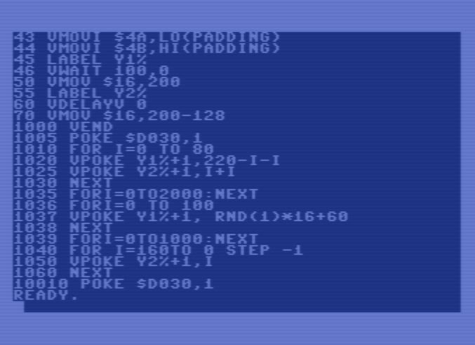

 Video and Display List coprocessor board for the Commodore 64
 
 https://beamracer.net

# VBASIC

VBASIC an easy, but powerful tool for programming Beam Racer with BASIC.



# Support

 Got questions or just need support? Visit our forum: https://forum.beamracer.net/

# Bug reports

 Please report any issue spotted using [GitHub's project tracker](https://github.com/madhackerslab/beamracer-examples/issues).
 If you'd like to contribute to the this project, please send regular pull request. But we recommend to open new
 [ticket](https://github.com/madhackerslab/beamracer-examples/issues) before doing any work.

# Cloning the repository

 **NOTE:** this project uses [git submodules](https://git-scm.com/book/en/v2/Git-Tools-Submodules),
 it's required to either use `--recurse-submodules` to get all the dependencies during cloning:

    git clone --recurse-submodules https://github.com/madhackerslab/beamracer-examples

 or to pull them manually by doing:

```
git submodule init
git submodule update
```

 after cloning the repository.

# License

 * Copyright &copy;2020 by Mad Hackers Lab and colaborators
 * This is open-sourced software licensed under the [MIT license](LICENSE.md)

